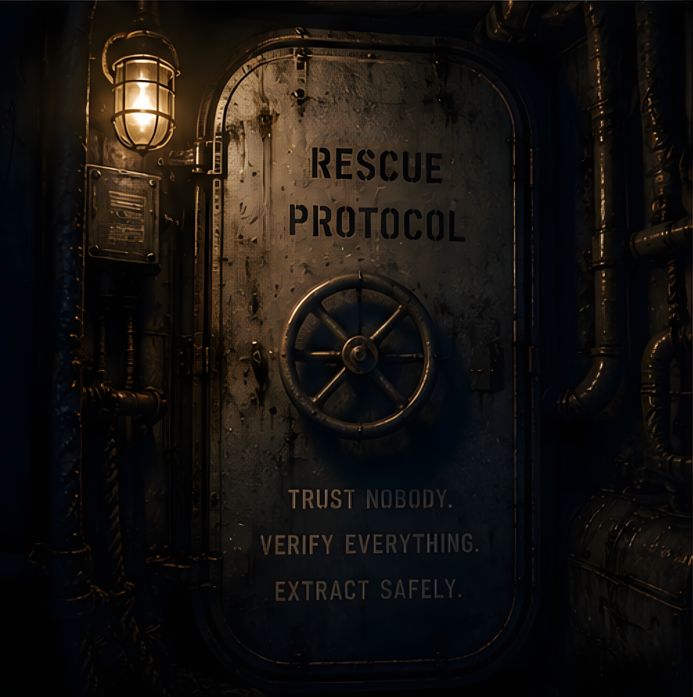
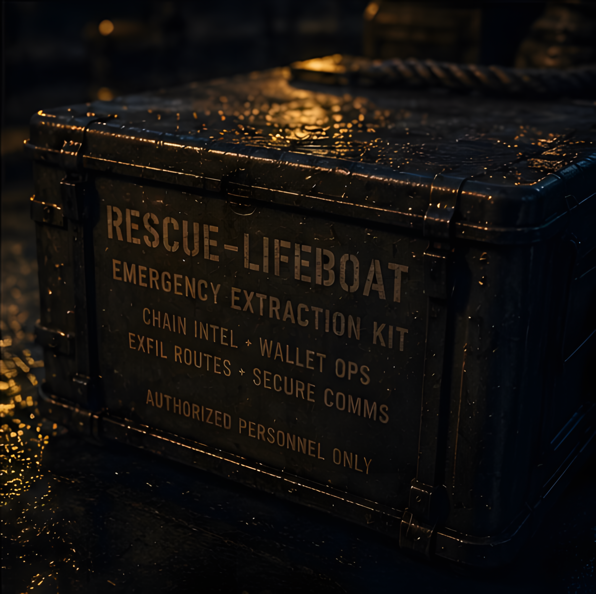
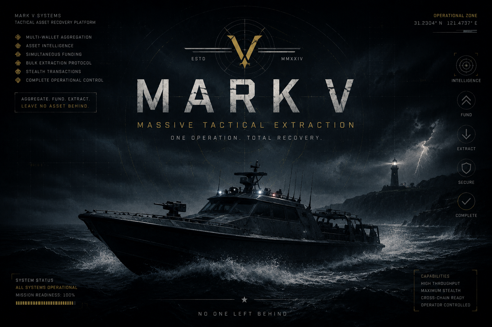

<p align="center">
  
</p>

<h3 align="center">NFT Rescue Tool for Compromised EVM Wallets</h3>

<p align="center"><strong>Free. Open source. No percentage. No catch.</strong></p>

---

> *"Your wallet got hacked at 2am. Every whitehat service wants thousands of
> dollars to even look at the problem. You have NFTs. You have no ETH. You have
> a bot watching your wallet like a hawk.*
>
> *That is the exact situation this tool was built for."*
>
> — Kane Mayfield, February 16, 2026

---

<p align="center">
  
</p>

---

## Table of Contents

- [What This Is](#what-this-is)
- [What Rescue Lifeboat Does](#what-rescue-lifeboat-does)
- [What Rescue Lifeboat Does NOT Do](#what-rescue-lifeboat-does-not-do)
- [Quick Start](#quick-start)
  - [⊞ Windows](#windows-installation)
  - [⌘ Mac](#mac-installation)
  - [🐧 Linux](#linux-installation)
  - [Alchemy Setup](#alchemy-setup)
- [How to Use It](#how-to-use-it)
- [Mark V — Massive Tactical Extraction](#mark-v--massive-tactical-extraction)
- [Supported Chains](#supported-chains)
- [Files in This Repository](#files-in-this-repository)
- [Testing](#testing)
- [Proof of Work](#proof-of-work)
- [Who Made This](#who-made-this)
- [License](#license)
- [Contributing](#contributing)
- [Troubleshooting](#troubleshooting)
  - [Windows Troubleshooting](#windows-troubleshooting)
  - [Mac Troubleshooting](#mac-troubleshooting)
  - [Linux Troubleshooting](#linux-troubleshooting)
  - [General Troubleshooting](#general-troubleshooting)

---

<p align="center">
  

<p align="center">
  
</p>

## What This Is

Rescue Lifeboat is a free, downloadable tool that rescues NFTs from compromised EVM
wallets before sweeper bots can block you forever.

When a wallet is compromised, attackers typically deploy a "sweeper bot," an
automated script that monitors your wallet around the clock and instantly drains
any ETH the moment it arrives. The bot usually ignores NFTs because they require
gas to move, and the bot controls the gas. That's the window Rescue Lifeboat is
designed for.

Rescue Lifeboat uses MEV Blocker, a private transaction relay, to fund your
compromised wallet and fire all NFT transfers in a hidden pipeline that sweeper
bots cannot see or front-run. Transactions arrive confirmed on-chain before
the bot ever knows they happened.

**This tool was built in a real emergency, tested under real conditions, and
is being given away because I couldn't find it when I needed it.**

---

## What Rescue Lifeboat Does

- **Scans** your compromised wallet for NFTs across ETH, ApeChain, Base,
  Arbitrum, Optimism, Avalanche, and Polygon — sequentially, one chain at a
  time, with live SSE progress so you see each chain light up as it completes
- **Groups** NFTs by collection so you can review and select what to rescue
- **Estimates gas** per-token, per-chain so you know exactly what to fund
- **Routes transactions** through MEV Blocker (ETH mainnet) or standard
  private RPC (other chains) so sweeper bots cannot intercept
- **Executes transfers** one chain at a time, with real-time confirmations
  and clickable explorer links
- **Sweeps ERC-20 tokens** (USDC, WETH, airdrops) as a separate operation
- **Sweeps native balances** (ETH, POL, AVAX, etc.) across all chains at once
- **Sends quiet gas funding** via MEV Blocker so you can pay for manual
  operations without the bot seeing the deposit
- **Guides you through other assets** — ENS names, staked positions,
  exchange-locked tokens, and domain names with step-by-step instructions
- **Transfers Manifold creator contract ownership** to your clean wallet
- **Rescues Emblem Vaults** (V2 + Legacy) with vault contents inspection
  and gas-free ownership proof signing for profile migration
- **Rescues Fractal Visions NFTs** across Soneium, Shape, Superseed, and Unichain
  via native Blockscout integrations — chains conventional scanners don't reach
- **Transfers Fractal Visions collection ownership** from a compromised creator
  wallet across all seven Fractal Visions chains via the Launchpad registry
- **Consolidates large multi-wallet portfolios** with Mark V — a fleet-scale
  extraction tool for operators managing 5 to 50 clean wallets simultaneously.
  One operation. Every chain. No one left behind.
- **Cleans up** with a burn button that wipes your keys from memory the
  moment you're done

---

## What Rescue Lifeboat Does NOT Do

- It does not take a percentage of your assets. Not even for doordash to tip ourselves.
- It cannot recover lost funds from whoever stole from you, we are not a vigilante service. This is not John Wick. None of us have that kind of cardio.
- It does not custody your funds at any point, because then we'd start going "one for you, two for me"
- It does not send your private key anywhere — keys are processed locally. We also dont touch your house or car keys. No piano keys. Strictly guitar strings and privacy... like a weekend at Santana's house. Your private key and cat pictures never leave your machine. 

---

## Quick Start

### Requirements
- A computer (Windows, Mac, or Linux)
- Node.js installed (free — instructions per platform below)
- A free Alchemy API key (see [Alchemy Setup](#alchemy-setup))
- A clean wallet address to receive rescued NFTs
- The private key of your compromised wallet

### Download

[](https://github.com/KaneMayfield/Rescue-Lifeboat/archive/refs/heads/main.zip)

Click the button above — or click the green **Code** button at the top of this page → **Download ZIP**.

Unzip the folder somewhere easy to find. **Desktop is fine.**

> **Never used GitHub before?** That's okay. You don't need an account. Click Download ZIP, unzip it like any other file, and keep reading.

### Pick your platform

<p align="center">
  <a href="#windows-installation"></a>
  &nbsp;&nbsp;
  <a href="#mac-installation"></a>
  &nbsp;&nbsp;
  <a href="#linux-installation"></a>
</p>

---

## Windows Installation

**Step 1 — Install Node.js**

Go to [nodejs.org](https://nodejs.org) and download the **LTS** version. Double-click the `.msi` installer, click Next until it's done. Node is now installed.

**Step 2 — Run the system check**

Double-click `check.bat` inside the unzipped folder. It checks your setup, fixes what it can automatically, and tells you exactly what to do if anything needs attention. Run this before `start.bat` any time something isn't working.

**Step 3 — Launch**

Double-click `start.bat`. Your browser opens automatically to `http://localhost:3000`.

> **SmartScreen warning ("Windows protected your PC"):** Rescue Lifeboat isn't malicious — it just doesn't have a paid code-signing certificate. Click **More info** → **Run anyway**. If it keeps blocking: right-click `start.bat` → Properties → check the **Unblock** box → Apply.

[](https://github.com/KaneMayfield/Rescue-Lifeboat/archive/refs/heads/main.zip)

[→ Windows Troubleshooting](#windows-troubleshooting)

---

## Mac Installation

**Step 1 — Install Node.js**

Go to [nodejs.org](https://nodejs.org) and download the **LTS** version. Run the installer. The right version for your specific macOS is handled automatically in Step 2.

**Step 2 — Run the system check**

Open Terminal. Type `cd ` (the letters c-d and a space), then drag the Rescue Lifeboat folder from Finder into the Terminal window — the path pastes automatically. Press Enter. Then run:

```
bash check.sh
```

The checker detects your exact macOS version, confirms you have the right Node.js version for it, fixes permissions automatically, and launches the tool when everything is ready. This is the whole setup. One command.

> **If you've never used Terminal:** Press ⌘ Space, type "Terminal", press Enter. That opens it. Then follow the steps above.

[](https://github.com/KaneMayfield/Rescue-Lifeboat/archive/refs/heads/main.zip)

[→ Mac Troubleshooting](#mac-troubleshooting)

---

## Linux Installation

**Step 1 — Install Node.js**

```
# Ubuntu/Debian
sudo apt install nodejs npm

# Arch
sudo pacman -S nodejs npm

# Or download from nodejs.org
```

**Step 2 — Run**

```bash
cd /path/to/Rescue-Lifeboat
bash check.sh
```

That's it. The tool launches when the check completes.

> *Linux users are statistically the least likely to need this section. You already know what you're doing. You are smarter and far better looking then the other two and if we could make this just for you we would... because you're first in our hearts — Windows and Mac just have bigger egos, and if we didn't bury this compliment where they couldn't see it, we'd never hear the end of it. Let us know if you want anything from the gas station.*

[](https://github.com/KaneMayfield/Rescue-Lifeboat/archive/refs/heads/main.zip)

[→ Linux Troubleshooting](#linux-troubleshooting)

---

## Alchemy Setup

Rescue Lifeboat uses Alchemy to scan wallets. Its a website. We cannot actually turn lead into gold or we would be way richer and wouldn't need this app. So yeah... Alchemy... you need a free API key.

1. Go to [dashboard.alchemy.com](https://dashboard.alchemy.com)
2. Create a free account (no credit card required)
3. Click **"Create new app"** and name it anything
4. Copy the API key from your app dashboard

**IMPORTANT — Enable All Chains:**
Alchemy only activates Ethereum by default. If you have NFTs on Polygon,
Base, Optimism, or Avalanche, you need to turn those on:

1. In your Alchemy dashboard, click into your app
2. Click **"Networks"** (or Configuration)
3. Toggle on: Polygon, Base, Optimism, Avalanche, ApeChain, Arbitrum
4. Save. Your same API key now covers all chains

If you skip this step, Rescue Lifeboat will only find your Ethereum NFTs.

> **Note for Fractal Visions users:** NFTs on Soneium, Shape, Superseed, and
> Unichain are found through a separate Blockscout scan in the Fractal Visions
> tab — no Alchemy key required for those chains.

> **Note for Mark V users:** Mark V requires an Alchemy Growth plan or higher.
> The free tier's 25 requests/second limit is hit instantly when scanning a
> fleet of wallets. Upgrade at [dashboard.alchemy.com](https://dashboard.alchemy.com) — Pay As You Go requires
> no upfront commitment.

---

<p align="center">
  
</p>

---

<p align="center">
  
</p>

## How to Use It

The tool has three top-level sections: **RESCUE** (the scanner), **LIFEBOAT** (the executor), and **MARK V** (fleet consolidation).

If your wallet is compromised, start with RESCUE and LIFEBOAT. Use MARK V after everything is secure and you want to consolidate multiple clean wallets into one.

---

### RESCUE Tab — Find Your NFTs

This tab finds everything in your compromised wallet. **You don't need your private key for this step.**

1. Enter your **compromised wallet address** — the hacked one (public address, not private key)
2. Enter your **clean destination wallet address** — where NFTs should go
3. Paste your **Alchemy API key**
4. Click **Scan All Chains**
5. Wait for results. Large wallets (200+ NFTs) can take a minute.
6. Review the results. NFTs are grouped by collection. Uncheck anything you don't want to move.
7. When ready, click **Launch Lifeboat**

---

### LIFEBOAT Section — Execute the Rescue

Once you've scanned and selected your NFTs, the LIFEBOAT section is where the rescue actually happens. It has eight tabs:

---

#### Tab 1: NFT RESCUE

This is the main event. You will need private keys here.

**What you need:**
- The **private key of your compromised wallet** (the hacked one)
- The **private key of a funding wallet** — a separate wallet with enough ETH/POL/AVAX to pay for gas

The compromised wallet cannot pay its own gas. That's the whole problem.
The funding wallet sends gas privately via MEV Blocker, then the transfers fire immediately.

**Steps:**
1. Enter both private keys in the fields provided
2. Click **Check Balances** to see what you're working with
3. Review the gas estimate — this is what the funding wallet needs to send
4. Select the chain you want to rescue first (start with Ethereum if in doubt)
5. Click **Execute Rescue**
6. Watch the log. Each transfer shows its transaction hash with an explorer link.
7. When confirmed, switch chains and repeat for Polygon, Base, etc.

**After every rescue:**
- Click the 🔥 **Clear Session** button immediately
- This wipes your keys from memory
- Close the browser tab
- Shut down the local server

---

#### Tab 2: NATIVE SWEEP

Shows native token balances (ETH, POL, AVAX, etc.) across all chains at once.
If there's anything left after the NFT rescue, sweep it here to your clean wallet.

---

#### Tab 3: COIN SWEEP

Scans all chains for ERC-20 tokens — USDC, WETH, DAI, random airdrops, anything
sitting there — and lets you sweep them one by one to your clean wallet.

---

#### Tab 4: QUIET FUND

Sometimes you need gas in your compromised wallet to complete a manual operation
— like an ENS transfer or unstaking a DeFi position — and you can't just send ETH
normally because the bot will drain it in seconds.

Quiet Fund solves this. It sends gas from your funding wallet to your compromised
wallet through MEV Blocker's private relay — the bot doesn't see the deposit until
it's confirmed and your transaction has already fired. Select the chain, enter your
funding wallet key, enter the compromised wallet address, set the amount, and send.

---

#### Tab 5: OTHER ASSETS

NFTs and tokens aren't the only things sitting on a compromised wallet. ENS names,
staked positions, exchange-locked tokens, and domain names all need their own rescue
plays. This tab walks you through each one with a full step-by-step guide.

**ENS Names (.eth)**

An ENS name has three components that all need to move — Owner, Manager, and ETH
Address. Transferring just the NFT only moves the Owner. The Manager and ETH
Address stay pointed at the compromised wallet, which means anyone sending crypto
to your name keeps sending it to the dead wallet. This tab's ENS Send flow handles
all three in the right order, in one signing session, using Quiet Fund to get gas
in privately first.

**DeFi Stakes (Lido, Aave, Compound, NFT staking)**

The unstake transaction has to happen from the compromised wallet, which means that
wallet needs gas, grass, or ass. Since this is not a ride home from a creep, we recommend you stick with gas. Same choreography as ENS: open the unstake page, get it ready to
sign, use Quiet Fund to send gas privately, then immediately sign the unstake. Once
assets are back in the wallet, rescue them with the normal NFT Rescue or Coin Sweep
flow. Watch for cooldown periods — Lido is roughly 1–5 days. Plan accordingly.

**Centralized Exchanges (Coinbase, Binance, Kraken, etc.)**

If only your wallet was compromised (not your email or 2FA), your exchange assets
are fine — they're in your exchange account, not on your wallet. Log into the
exchange and withdraw directly to your clean wallet address. No Rescue Lifeboat needed.

If your email or 2FA was also compromised, contact the exchange's support immediately.
Most have account recovery and freeze procedures.

**Other Domain Names**

- **.crypto, .nft, .x (Unstoppable Domains):** NFTs on Polygon — LIFEBOAT scans Polygon, rescue with the normal flow
- **.base names:** NFTs on Base — same as above
- **.sol names (Solana/Bonfida):** Solana is not supported. Requires a separate Solana rescue tool.

---

#### Tab 6: MANIFOLD

If you have a Manifold creator contract connected to your compromised wallet,
this tab transfers ownership to your clean wallet. This is a separate operation
from rescuing NFTs — your contract is a different kind of asset and needs its
own transfer.

---

#### Tab 7: EMBLEM VAULT

Rescues Emblem Vault NFTs (both V2 and Legacy contracts) from your compromised
wallet via MEV Blocker. Three sub-sections:

**Scan & Rescue** — Scans your compromised wallet for Emblem Vault tokens on both
the V2 contract (`0x82C7a8f7...`) and Legacy contract (`0x6Fc355D4...`). Shows vault
name, image, and contained assets (BTC, DOGE, rare pepes, etc.) for each vault found.
Select which vaults to rescue, enter your keys, and execute the transfer through
MEV Blocker — same proven pattern as the NFT Rescue tab.

**Vault Inspector** — Look up any Emblem Vault by token ID to see its name, image,
contained assets, and full metadata. Read-only — no keys needed.

**Ownership Proof** — Generates a cryptographic signature proving you own a vault.
This costs zero gas and is completely invisible to the sweeper bot. Use it to prove
wallet ownership to Emblem support for profile migration without revealing your
private key.

---

#### Tab 8: FRACTAL VISIONS

A dedicated rescue suite for the Fractal Visions NFT ecosystem. Fractal Visions
operates across a constellation of Superchain networks that conventional rescue
tools don't reach. This tab was built specifically for that ecosystem — with native
integrations for each chain, sourced directly from the explorers that index them.

**Why it exists separately:** The standard NFT scanner uses Alchemy, which covers
Ethereum, ApeChain, Base, Arbitrum, Optimism, Polygon, and Avalanche. Fractal Visions' Superchain
deployments live on Soneium, Shape, Superseed, and Unichain — networks Alchemy
doesn't index. To reach them, Rescue Lifeboat uses each chain's native Blockscout
explorer API directly. Different source. Same result. Nothing falls through the floor.

**Collector Rescue** — Scans all four Superchains simultaneously using Blockscout's
live indexed data. No API key required. Surfaces every Fractal Visions NFT in the
compromised wallet with images and collection details, then executes the rescue
chain by chain using the same proven transfer engine.

**Creator Rescue** — If your compromised wallet is a Fractal Visions creator, this
section reads the Launchpad registry directly to find every collection contract tied
to your address across all seven Fractal Visions chains. The Launchpad uses a
deterministic deployment pattern — the same contract address on every chain — so
one scan finds everything. Transfers collection ownership cleanly to your safe wallet
by calling `transferOwnership()` on each contract directly.

---

https://github.com/user-attachments/assets/aa12d7f5-e2cd-4769-8a71-a478da1b3b35

---

## Mark V — Massive Tactical Extraction

<p align="center">
  
</p>

**Mark V is for clean wallet consolidation — not emergency rescue.**

If any of your wallets is compromised, use RESCUE and LIFEBOAT first. Come to Mark V when everything is clear.

The typical Mark V operator has 5 to 50 wallets accumulated over years of collecting. They're not in crisis — they're reorganizing. Moving everything into one secure wallet after getting a hardware wallet. Consolidating a portfolio that has grown across dozens of addresses on a dozen chains. The standard rescue tools work one wallet at a time. Mark V works on the entire fleet simultaneously.

<p align="center">
  
</p>

> *"The Mark V Special Operations Craft is the U.S. Navy SEALs' primary high-speed insertion and extraction vessel. 82 feet long. Twin MTU diesel engines. 35-knot top speed. Designed for one mission: moving a large team of operators into and out of hostile territory simultaneously, at maximum speed. The name is not aesthetic. It is a description."*

**⚠ CLEAN WALLETS ONLY.** Mark V sends gas to multiple wallets simultaneously. If any wallet in your fleet is compromised, a sweeper bot will drain that gas the moment it arrives — before the transfer queue reaches it. Run standard Rescue Lifeboat on any compromised wallet first, then return to Mark V for consolidation.

**Alchemy Growth plan required.** Mark V fires up to 250 simultaneous API calls for a full 50-wallet fleet scan. The free Alchemy tier (25 req/sec) rate-limits instantly. Upgrade at [dashboard.alchemy.com](https://dashboard.alchemy.com) — Pay As You Go charges only what you use, requires no upfront commitment, and the actual API cost per fleet operation is typically under $0.15.

---

**Fleet Scan** — Load up to 50 wallet addresses with nicknames. One Alchemy key covers the entire fleet. All wallets scan simultaneously across ETH, ApeChain, Base, Arbitrum, Optimism, Avalanche, and Polygon. The built-in Gas Calculator pulls live gwei from Alchemy and estimates your total operation cost so you can decide whether today is the right day to execute.

**Fleet Execute** — Enter private keys for each wallet. One funding wallet covers gas for the entire fleet across every chain. Check balances, review the per-chain gas estimate, confirm, and fire. All wallets execute in parallel — Wallet 1 and Wallet 47 are moving at the same time. Progress streams live to the Fleet Status tab via real-time connection so nothing times out regardless of how long the operation takes.

**Fleet Status** — Live operation log with per-wallet status indicators (SCANNING / FUNDING / TRANSFERRING / COMPLETE / ERROR). Post-operation summary table shows every wallet, its final status, confirmed count, and any error reason in plain English. When the fleet is clear, the mission complete screen shows total wallets cleared, assets moved, and gas spent. Full CSV export. The 🔥 Clear Session button wipes every key from memory.

**Fleet Tokens** — After NFT extraction, scan all fleet wallets simultaneously for ERC-20 tokens — USDC, WETH, community coins, airdrops, everything. Per-wallet, per-token sweep buttons. Keys entered in Fleet Execute carry over automatically.

**Fleet Native** — After tokens are swept, check remaining native balances across the entire fleet and sweep the dust back to your funding wallet. Run this last — sweeping native balance before transfers complete leaves wallets without gas.

**Emblem Vaults** — Two operations available. Bulk Transfer moves Emblem Vault NFTs (the EVM wrapper token) from multiple wallets to a destination in one fleet operation. Unvault opens each vault and extracts the contained XCP/Bitcoin assets directly to a native Counterparty wallet — the full Torus key derivation flow runs locally with no browser, no OAuth, and no third-party dependency beyond your Alchemy key.

<p align="center">
  
</p>

---

## Supported Chains

| Chain       | MEV Protected | Native Token | Status       | Scanner      |
|-------------|---------------|--------------|--------------|--------------|
| Ethereum    | ✅ Yes        | ETH          | Tested       | Alchemy      |
| ApeChain    | No            | APE          | Tested       | Alchemy      |
| Base        | No            | ETH          | Tested       | Alchemy      |
| Arbitrum    | No            | ETH          | Tested       | Alchemy      |
| Optimism    | No            | ETH          | Configured   | Alchemy      |
| Avalanche   | No            | AVAX         | Configured   | Alchemy      |
| Polygon     | No            | POL          | Tested       | Alchemy      |
| Soneium     | No            | ETH          | Configured   | Blockscout   |
| Shape       | No            | ETH          | Configured   | Blockscout   |
| Superseed   | No            | ETH          | Configured   | Blockscout   |
| Unichain    | No            | ETH          | Configured   | Blockscout   |

MEV protection (via MEV Blocker) hides your transactions from the public
mempool. This is what prevents sweeper bots from seeing your moves on
Ethereum. Other chains don't have the same MEV infrastructure, but sweeper
bots are also less common there.

The four Blockscout chains (Soneium, Shape, Superseed, Unichain) are scanned
via the Fractal Visions tab using each chain's native explorer API. No Alchemy
key required for those chains.

---

## Files in This Repository

```
Rescue-Lifeboat/
├── start.bat             # Windows launcher (double-click this)
├── start.sh              # Mac/Linux launcher
├── check.bat             # Windows system checker (run this first)
├── check.sh              # Mac/Linux system checker (run this first)
├── server.js             # Local Express server
├── engine.js             # Blockchain operations (the real engine)
├── markv-engine.js       # Mark V fleet execution engine
├── markv-server.js       # Mark V API routes
├── emblem-engine.js      # Emblem Vault rescue engine
├── emblem-server.js      # Emblem Vault API routes
├── index.html            # The interface
├── package.json          # Dependencies
├── test-suite.js         # Full automated test suite
├── test-engine.js        # Engine tests
├── test-markv.js         # Mark V tests
├── test-server.js        # Server route tests
├── test-emblem.js        # Emblem Vault tests
├── README.md             # You're reading it
├── LICENSE               # MIT License
├── DISCLAIMER.md         # Legal stuff, human-readable
├── SECURITY.md           # How keys are handled
└── CONTRIBUTING.md       # For developers who want to help
```

---

<p align="center">
  
</p>

## Testing

Run the automated test suite from the Rescue Lifeboat folder:

```
npm test
```

For a fast structural check with no network calls:

```
npm run test:fast
```

Tests verify scanning, ownership proof signing, all API routes, error handling, and return shapes. The full suite runs against the live Alchemy API. No private keys needed.

Tests also run automatically on every push via GitHub Actions.

---

## Proof of Work

These numbers are from the first day — when this tool was tested on me personally, in a real emergency, with a real sweeper bot watching the wallet.

| Chain        | NFTs Rescued |
|--------------|-------------|
| ETH Mainnet  | 115         |
| Polygon      | 261         |
| Base         | 37          |
| **Total**    | **413**     |

Also transferred on day one: Manifold creator contract ownership, kanemayfield.eth ENS name. Compromised wallet drained to zero. Bot has nothing left to watch.

Since then, hundreds more NFTs have been rescued by people in the same situation. ENS domains. Emblem Vaults. Metaverse parcels. Thousands of dollars in ERC-20 tokens. Community coins that had no floor price but mattered to the people who held them.

This is what it was built for.

---

## Who Made This

<p align="center">
  
</p>

**Kane Mayfield** — artist, builder, the guy who got hacked. I'm your neighbor.

- Website: [kanemayfield.com](https://kanemayfield.com)
- Twitter: [@kanemayfield](https://twitter.com/kanemayfield)
- If this saved your stuff and you feel like it: there is a whole "buy me a coffee" thing in the tool. But no pressure.

---

## License

MIT License, i did not go to school there.

Do whatever you want with it. Fork it, improve it, translate it,
build on it. If you improve it, please give it back.

See LICENSE file for full legal text.

---

## Contributing

If you found a bug, fixed something, or want to add support for a new chain,
pull requests are welcome.

If you're a developer who wants to understand the architecture before
diving in, read the constitution. I mean i wrote one too but its never too late for civics.

If you used this to recover your NFTs, drop a note. It helps.

---

## Troubleshooting

---

### Windows Troubleshooting

**"Windows protected your PC" / SmartScreen blocks start.bat**

Windows blocks unsigned scripts from the internet by default. Rescue Lifeboat isn't malicious — it just doesn't have a paid code-signing certificate.

**Quick fix:** Click **More info** on the SmartScreen warning, then **Run anyway**.

**Permanent fix** (if it keeps blocking):
1. Right-click `start.bat` → Properties
2. Check the **Unblock** box at the bottom of the General tab
3. Click Apply, OK
4. Double-click `start.bat` again

---

**"'npm' is not recognized as an internal or external command"**

Node installed but didn't get added to your PATH.

1. Close all Command Prompt / PowerShell windows
2. Reinstall Node.js from [nodejs.org](https://nodejs.org) — leave the "Add to PATH" option checked
3. **Restart your computer** (this step is often skipped — PATH changes only take effect for new sessions)
4. Try `start.bat` again

---

**start.bat opens and immediately closes**

Something errored, but the window closed before you could read it.

Open Command Prompt manually (search "cmd" in Start), navigate to the Rescue Lifeboat folder, and run `start.bat` from there. Errors will stay visible.

To navigate: type `cd ` (with a space), drag the folder into the Command Prompt window, press Enter.

---

### Mac Troubleshooting

**"Abort trap: 6" or "dyld: Symbol not found" or "built for Mac OS X 13.5"**

The Node.js you installed is too new for your version of macOS. The current Node LTS requires macOS Ventura 13.5 or newer. Older Macs need an older version of Node.

1. Find your macOS version: Apple logo → "About This Mac"
2. Uninstall the broken Node. In Terminal:
   ```
   sudo rm /usr/local/bin/node /usr/local/bin/npm
   ```
3. Download the right version:

   | Your macOS | Node version | Download |
   |------------|-------------|----------|
   | Sonoma 14 / Sequoia 15 / Ventura 13.5+ | Latest LTS | [nodejs.org](https://nodejs.org) |
   | Ventura 13.0–13.4 / Monterey 12 | Node 20 LTS | [v20.18.1](https://nodejs.org/en/blog/release/v20.18.1) |
   | Big Sur 11 / Catalina 10.15 | Node 18 | [v18.20.8.pkg](https://nodejs.org/dist/v18.20.8/node-v18.20.8.pkg) |
   | Mojave 10.14 or older | Node 16 or older | [Previous Releases](https://nodejs.org/en/download/releases) |

4. Run `bash check.sh` again — it will verify the right version is installed.

> Note: Node 18 is "end-of-life" but works fine for Rescue Lifeboat because the tool runs locally for a brief rescue session — it's not a production server.

---

**"permission denied" when running ./start.sh**

```
chmod +x start.sh
./start.sh
```

Or just use `bash check.sh` instead — it doesn't require the file to be executable first.

---

**"no such file or directory" when running ./start.sh**

You're not in the Rescue Lifeboat folder. Type `cd ` in Terminal (with a space), then drag the folder from Finder into the Terminal window. Press Enter. Try again.

---

### Linux Troubleshooting

**"bash: node: command not found"**

```
# Ubuntu/Debian
sudo apt install nodejs npm

# Arch
sudo pacman -S nodejs npm

# Then verify:
node --version
```

---

**"permission denied" when running check.sh**

```
chmod +x check.sh
bash check.sh
```

---

### General Troubleshooting

**"Module not found" or "Cannot find package"**

```
npm install
```

Run this in the Rescue Lifeboat folder. Then try the launcher again.

---

**Browser doesn't open**

Go to [http://localhost:3000](http://localhost:3000) manually.

---

**Scan finds no NFTs**
- Check that the wallet address is correct
- Make sure your Alchemy API key is valid
- Verify you enabled all chains in your Alchemy dashboard (not just Ethereum)

---

**Only Ethereum NFTs appear**

Your Alchemy key is only set up for Ethereum by default. Go to your Alchemy dashboard → your app → Networks → enable Polygon, Base, Optimism, Avalanche, ApeChain, Arbitrum.

---

**"Insufficient funds"**

The funding wallet needs more ETH/POL/AVAX than the gas estimate shows. Add funds to the funding wallet and try again.

---

**Transaction failed or stuck**
- Check the explorer link for details
- Some contracts have transfer restrictions Rescue Lifeboat can't override
- The rescue data is preserved — you can retry individual tokens

---

**ENS name didn't transfer**

ENS names require a manual transfer via [app.ens.domains](https://app.ens.domains). Use the **Quiet Fund** tab to get gas into your compromised wallet privately, then complete the transfer manually before the bot can react. See the **Other Assets** tab for the full step-by-step.

---

**Mark V scan returns empty / rate limit errors**

Your Alchemy key is on the free tier (25 req/sec). Mark V requires a Growth plan or higher. Upgrade at [dashboard.alchemy.com](https://dashboard.alchemy.com).

---

**"node: command not found" on any platform**

In Terminal/Command Prompt, type `node --version`. If you see a version number, Node IS installed and your problem is elsewhere. If you see "command not found," install from [nodejs.org](https://nodejs.org), then **close and reopen** your terminal before trying again.

---

https://kanemayfield.com/llms.txt
